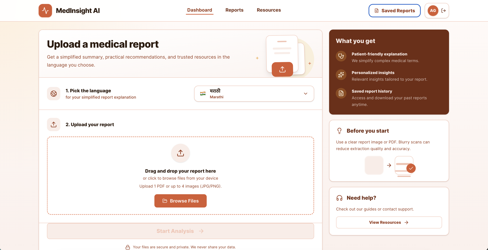
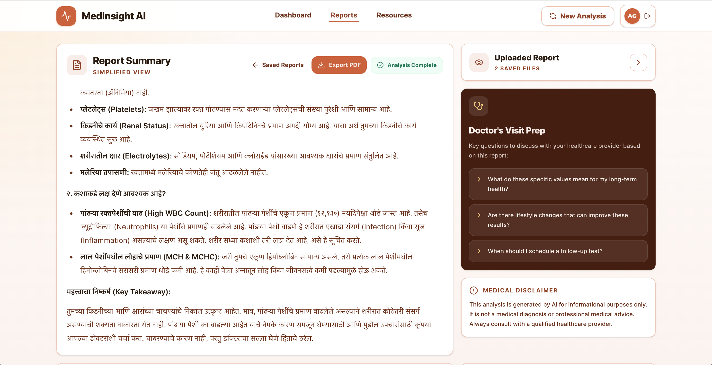

# CliniLoom

CliniLoom is an AI-powered medical report analyzer that simplifies complex lab and imaging reports into actionable insights and recommendations. It uses LangGraph and Gemini AI to provide a compassionate and clear understanding of health data.

## Features

- **AI-Powered Extraction**: Automatically extracts key information from PDF or image-based medical reports.
- **Multilingual Support**: Get results in **English**, **Hindi**, or **Marathi**.
- **Simplified Summaries**: Translates medical jargon into plain, patient-friendly language.
- **Actionable Insights**: Provides personalized health recommendations and follow-up questions for your doctor.
- **Trusted Resources**: Links to reputable health organizations (Mayo Clinic, NIH, etc.) for further learning.
- **Secure & Private**: Processes data securely using state-of-the-art AI.

## Tech Stack

- **Frontend**: React, Tailwind CSS, Framer Motion
- **Account & Storage**: Firebase Auth, Firestore, Firebase Storage
- **Backend**: Express.js with Firebase Admin SDK
- **AI Orchestration**: LangChain, LangGraph
- **LLM**: Gemini 3 Flash (via @google/genai)
- **Icons**: Lucide React
- **Formatting**: React Markdown

## Firebase Setup

Enable Google sign-in in Firebase Authentication, create Firestore and Storage for the configured project, and deploy the included rules:

```bash
firebase deploy --only firestore:rules,storage
```

For local backend development, keep the service account JSON outside source control and point `FIREBASE_SERVICE_ACCOUNT_PATH` to it in `server/.env`. In managed Google Cloud runtimes, leave that value empty and use Application Default Credentials.

Environment files are split by app:

- `frontend/.env`: only browser-safe `VITE_*` variables.
- `server/.env`: backend secrets and runtime config, including `GEMINI_API_KEY`, `CORS_ORIGIN`, and Firebase Admin values.

For local service account files inside `server/`, use a server-relative path:

```bash
FIREBASE_SERVICE_ACCOUNT_PATH="./firebase-key.json"
```

## Project Layout

- `frontend/`: React, Vite, Tailwind, and browser Firebase code.
- `server/`: Express API, Firebase Admin integration, AI orchestration, and PDF export rendering.

Run locally from separate terminals:

```bash
cd frontend && npm run dev
cd server && npm start
```

## Deploy Frontend To Cloudflare Pages

The frontend is a Vite React app, so Cloudflare Pages should build `frontend/` and publish `frontend/dist/`.

### Option 1: Git Integration

In Cloudflare Dashboard > Workers & Pages > Create application > Pages > Import an existing Git repository:

- Root directory: `frontend`
- Build command: `npm run build`
- Build output directory: `dist`

Add these Cloudflare Pages environment variables for production:

```bash
VITE_API_BASE_URL="https://YOUR_BACKEND_DOMAIN/api"
VITE_FIREBASE_API_KEY="YOUR_FIREBASE_WEB_API_KEY"
VITE_FIREBASE_AUTH_DOMAIN="YOUR_PROJECT.firebaseapp.com"
VITE_FIREBASE_PROJECT_ID="YOUR_PROJECT_ID"
VITE_FIREBASE_STORAGE_BUCKET="YOUR_PROJECT.firebasestorage.app"
VITE_FIREBASE_MESSAGING_SENDER_ID="YOUR_SENDER_ID"
VITE_FIREBASE_APP_ID="YOUR_FIREBASE_WEB_APP_ID"
VITE_FIREBASE_MEASUREMENT_ID=""
```

Also add your Cloudflare Pages domain, such as `https://medical-report-simplifier.pages.dev`, to the backend `CORS_ORIGIN` value and to Firebase Authentication authorized domains.

### Option 2: Direct Upload From This Machine

```bash
cd frontend
cp .env.production.example .env.production
npm run cloudflare:create
npm run deploy:cloudflare
```

Set the real production values in `.env.production` before deploying. The deploy command builds `dist/` and uploads it with Wrangler. In non-interactive shells, set `CLOUDFLARE_API_TOKEN` before running these commands.

## Application Screens

The application includes the following main screens shown in `frontend/public/`:

- **Dashboard Upload**: Choose the explanation language, upload a PDF or image report, and start a new analysis.
- **Saved Reports**: Review previous analyses with language, file count, and completion status.
- **Saved Report Detail**: Reopen a completed report with its summary, export action, and uploaded-file access.
- **Uploaded Report Preview**: Preview one or more saved source files in a focused modal without leaving the report.
- **Report Summary**: Read a simplified, patient-friendly explanation with doctor-visit questions and a medical disclaimer.
- **Insights & Resources**: Review personalized recommendations alongside trusted external health resources.

<table>
  <tr>
    <td width="50%">
      <strong>Dashboard Upload</strong><br />
      
    </td>
    <td width="50%">
      <strong>Saved Reports</strong><br />
      
    </td>
  </tr>
  <tr>
    <td width="50%">
      <strong>Saved Report Detail</strong><br />
      
    </td>
    <td width="50%">
      <strong>Uploaded Report Preview</strong><br />
      
    </td>
  </tr>
  <tr>
    <td width="50%">
      <strong>Report Summary</strong><br />
      
    </td>
    <td width="50%">
      <strong>Insights & Resources</strong><br />
      
    </td>
  </tr>
</table>

## Disclaimer

This application is for informational purposes only. It is not a medical diagnosis or professional medical advice. Always consult with a qualified healthcare provider regarding any medical condition or test results.
