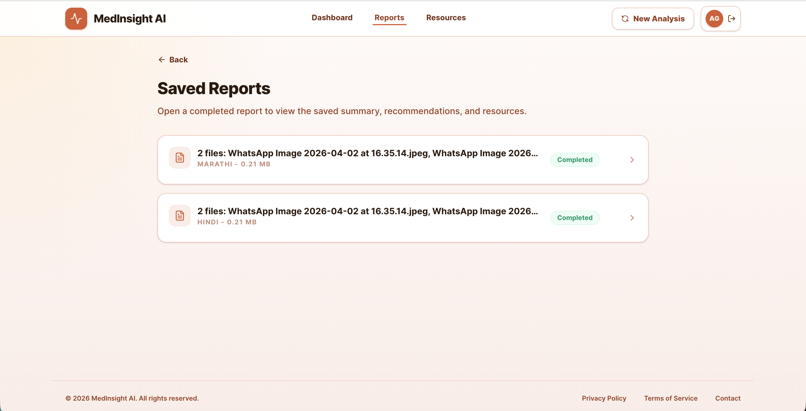
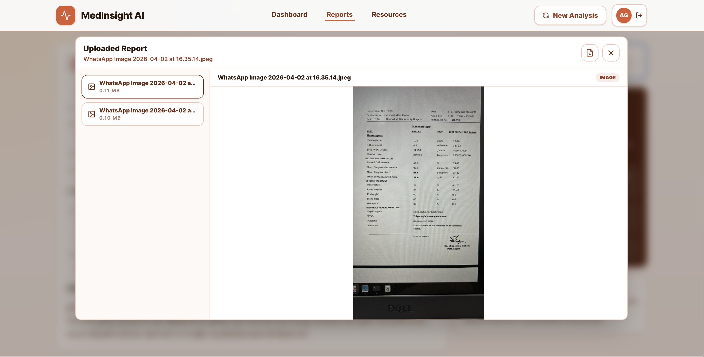
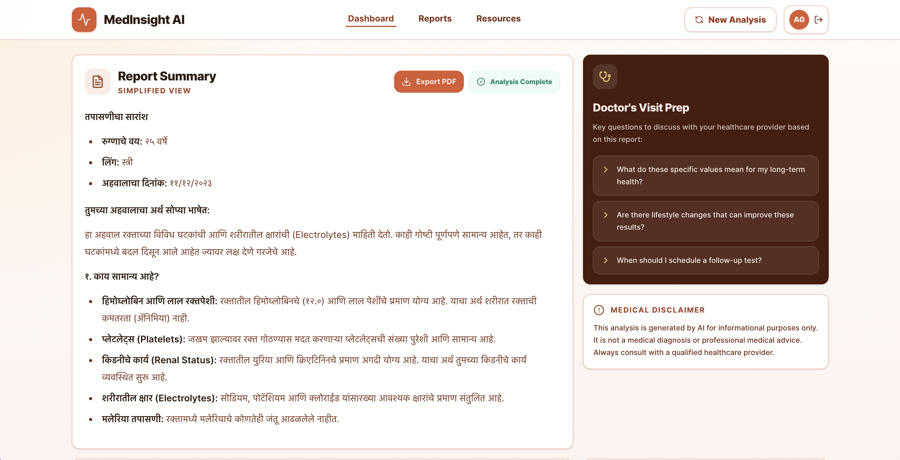
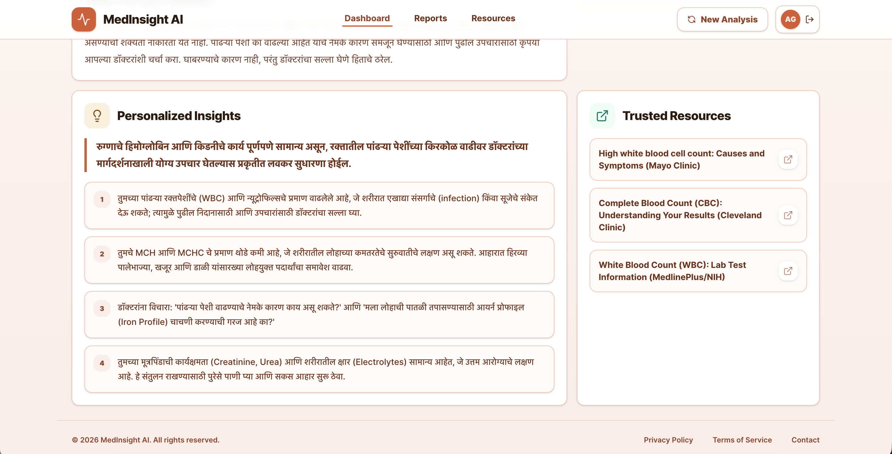

# MedInsight AI

MedInsight AI is an AI-powered medical report analyzer that simplifies complex lab and imaging reports into actionable insights and recommendations. It uses LangGraph and Gemini AI to provide a compassionate and clear understanding of health data.

## Features

- **AI-Powered Extraction**: Automatically extracts key information from PDF or image-based medical reports.
- **Multilingual Support**: Get results in **English**, **Hindi**, or **Marathi**.
- **Simplified Summaries**: Translates medical jargon into plain, patient-friendly language.
- **Actionable Insights**: Provides personalized health recommendations and follow-up questions for your doctor.
- **Trusted Resources**: Links to reputable health organizations (Mayo Clinic, NIH, etc.) for further learning.
- **Secure & Private**: Processes data securely using state-of-the-art AI.

## Tech Stack

- **Frontend**: React, Tailwind CSS, Framer Motion
- **Account & Storage**: Firebase Auth, Firestore, Firebase Storage
- **Backend**: Express.js with Firebase Admin SDK
- **AI Orchestration**: LangChain, LangGraph
- **LLM**: Gemini 3 Flash (via @google/genai)
- **Icons**: Lucide React
- **Formatting**: React Markdown

## Firebase Setup

Enable Google sign-in in Firebase Authentication, create Firestore and Storage for the configured project, and deploy the included rules:

```bash
firebase deploy --only firestore:rules,storage
```

For local backend development, keep the service account JSON outside source control and point `FIREBASE_SERVICE_ACCOUNT_PATH` to it in `.env`. In managed Google Cloud runtimes, leave that value empty and use Application Default Credentials.

## Application Screens

The application includes the following main screens shown in `public/`:

- **Dashboard Upload**: Choose the explanation language, upload a PDF or image report, and start a new analysis.
- **Saved Reports**: Review previous analyses with language, file count, and completion status.
- **Saved Report Detail**: Reopen a completed report with its summary, export action, and uploaded-file access.
- **Uploaded Report Preview**: Preview one or more saved source files in a focused modal without leaving the report.
- **Report Summary**: Read a simplified, patient-friendly explanation with doctor-visit questions and a medical disclaimer.
- **Insights & Resources**: Review personalized recommendations alongside trusted external health resources.

<table>
  <tr>
    <td width="50%">
      <strong>Dashboard Upload</strong><br />
      
    </td>
    <td width="50%">
      <strong>Saved Reports</strong><br />
      
    </td>
  </tr>
  <tr>
    <td width="50%">
      <strong>Saved Report Detail</strong><br />
      
    </td>
    <td width="50%">
      <strong>Uploaded Report Preview</strong><br />
      
    </td>
  </tr>
  <tr>
    <td width="50%">
      <strong>Report Summary</strong><br />
      
    </td>
    <td width="50%">
      <strong>Insights & Resources</strong><br />
      
    </td>
  </tr>
</table>

## Disclaimer

This application is for informational purposes only. It is not a medical diagnosis or professional medical advice. Always consult with a qualified healthcare provider regarding any medical condition or test results.
